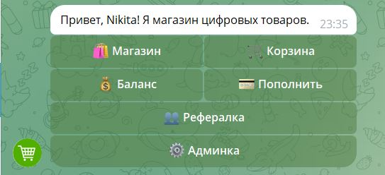
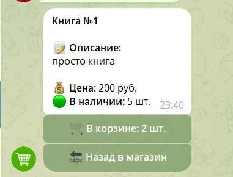
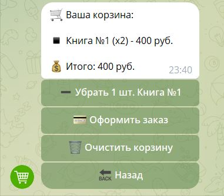
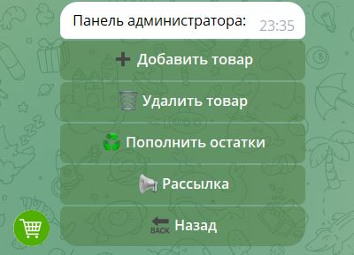
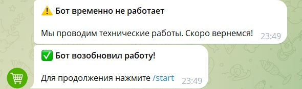

# 🛒 Telegram Shop Bot

Полнофункциональный бот-маркетплейс для продажи цифровых товаров (ключи, аккаунты, PDF, курсы) в Telegram. Написан на Python с использованием современного асинхронного фреймворка Aiogram 3.x и конечных автоматов (FSM).


---

## 🚀 Возможности

### 👤 Пользовательская часть
- 🛍 **Каталог товаров:** Просмотр карточек с описанием и динамическим отображением остатков на складе.
- 🛒 **Умная корзина:** Добавление нескольких единиц одного товара, изменение количества, подсчет итоговой суммы перед оплатой.
- 💰 **Внутренний баланс:** Пополнение баланса (реализована тестовая оплата) и оплата заказов из корзины.
- 👥 **Реферальная система:** Двухэтапная система лояльности. Бонус пригласившему (100 руб.) начисляется только после первой покупки рефералом (защита от накрутки пустыми аккаунтами).
- 🔔 **Уведомления:** Автоматические оповещения пользователям о технических работах при выключении/включении сервера.

### ⚙️ Панель администратора
- 📦 **CRUD товары:** Добавление (с поддержкой загрузки файлов или текстовых ссылок), удаление, пополнение остатков прямо в боте.
- 🛡 **Управление заказами:** Безопасное списание остатков при покупке с проверкой доступности на складе в момент оплаты.
- 📢 **Безопасная рассылка:** Глобальная рассылка сообщений всем пользователям из БД с защитой от лимитов Telegram (Rate Limit 429).

---

## 🧠 Под капотом (Архитектурные решения)

Проект реализован с учетом поведения реальных пользователей и защитой от edge-кейсов:

> **Защита от Race Condition (Состояние гонки)**
> Если два пользователя одновременно кладут в корзину товар, остаток которого равен 1, система не позволяет обоим его купить. При оформлении заказа (Checkout) происходит повторная проверка остатков в БД. Если товар уже куплен, пользователь моментально получает уведомление: *"Товар закончился, пока лежал в корзине!"*, и товар автоматически удаляется из его корзины.

> **Умная реферальная система**
> В отличие от простых ботов, где бонус дается просто за переход по ссылке, здесь используется триггер "Первая покупка". В БД хранится флаг `referral_bonus_claimed`. Это гарантирует, что приглашенный человек совершил целевое действие, а не просто зашел и вышел, защищая владельца от накрутки.

---

## ⚙️ Архитектура и технологии

- **FSM (Finite State Machine):** Разделение состояний для админки и пополнения баланса.
- **Обработка ошибок:** Защита от падения бота при многократном нажатии инлайн-кнопок (`MessageNotModified`).
- **Безопасность:** Безопасное хранение токенов через `.env` (переменные окружения).

### 🛠 Технологический стек
- [Python 3.10+](https://www.python.org/)
- [Aiogram 3.x](https://docs.aiogram.dev/en/latest/) (асинхронный фреймворк)
- [SQLite3](https://www.sqlite.org/) (встроенная реляционная БД)
- [aiohttp](https://docs.aiohttp.org/) (асинхронные HTTP-запросы)

---

## 📸 Скриншоты

**Главное меню**




**Добавление в корзину**




**Корзина**




**Админ-панель**




**Уведомление о тех. работах**




---

## ⚡ Быстрый старт

1. Клонируйте репозиторий:
   ```bash
   git clone https://github.com/Nikita031204/Telegram_shop_bot.git
   ```

2. Установите зависимости:
   ```bash
   pip install aiogram aiofiles
   ```

3. Создайте файл `.env` в корневой директории и заполните его:
   ```env
   BOT_TOKEN=ваш_токен_от_BotFather
   ADMIN_ID=ваш_telegram_id
   ```

4. Запустите бота:
   ```bash
   python bot.py
   ```

